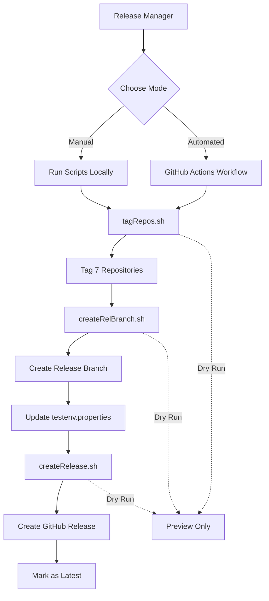

# AQAvit Release Process - Comprehensive Plan

## Executive Summary

This document outlines a comprehensive plan to improve the AQAvit release process by fixing existing script bugs, creating missing functionality, and providing detailed documentation.

## Current State Analysis

### Existing Components

1. **[`scripts/tagRepos.sh`](../scripts/tagRepos.sh)** - Tags multiple AQAvit repositories
2. **[`scripts/createRelBranch.sh`](../scripts/createRelBranch.sh)** - Creates release branch with updated configuration
3. **[`.github/workflows/createAQAvitRelease.yml`](../.github/workflows/createAQAvitRelease.yml)** - GitHub Actions workflow (incomplete)

### Release Process Flow


## Issues Identified

### Critical Issues in [`tagRepos.sh`](../scripts/tagRepos.sh)

| Line | Issue | Impact | Fix Required |
|------|-------|--------|--------------|
| 4-9 | Missing `isDryRun` parameter capture | Script fails when checking dry-run mode | Add `isDryRun=$2` |
| 19-22 | Inverted dry-run logic | Pushes when it shouldn't, doesn't push when it should | Swap conditions |
| 12 | Hardcoded repository list | Not flexible for different release scenarios | Make configurable |
| N/A | No error handling | Silent failures possible | Add validation |

### Critical Issues in [`createRelBranch.sh`](../scripts/createRelBranch.sh)

| Line | Issue | Impact | Fix Required |
|------|-------|--------|--------------|
| 4-11 | Missing `isDryRun` parameter capture | Script fails when checking dry-run mode | Add `isDryRun=$3` |
| 22 | Wrong variable name `${gitTag}` | Branch creation fails | Change to `${aqavitGitTag}` |
| 33 | Wrong comparison operator `eq` | Condition always fails | Change to `==` |
| 52 | Missing `git add` before commit | Commit fails with no staged changes | Add `git add` command |
| 55 | Undefined `isDryRun` variable | Condition check fails | Capture parameter properly |

### Issues in [`.github/workflows/createAQAvitRelease.yml`](../.github/workflows/createAQAvitRelease.yml)

| Line | Issue | Impact | Fix Required |
|------|-------|--------|--------------|
| 32 | Wrong script path `./tagRepos.sh` | Workflow fails to find script | Change to `./scripts/tagRepos.sh` |
| 34-35 | Release branch step commented out | Incomplete automation | Uncomment and fix |
| N/A | Missing release creation step | Manual GitHub release required | Add new step |
| N/A | Unused workflow inputs | Confusing interface | Wire up all inputs |

### Missing Functionality

1. **No GitHub release creation script** - Mentioned in README but not implemented
2. **No comprehensive documentation** - Process not clearly documented
3. **No troubleshooting guide** - Common issues not documented
4. **No validation** - Scripts don't validate prerequisites or inputs

## Proposed Solution

### Architecture Overview



### Script Improvements

#### 1. Enhanced [`tagRepos.sh`](../scripts/tagRepos.sh)

**Fixes:**
- Add `isDryRun=$2` parameter capture
- Fix inverted dry-run logic (swap conditions on lines 19-22)
- Add parameter validation
- Add error handling for git operations
- Add progress indicators

**Enhancements:**
- Make repository list configurable via parameter or config file
- Add option to tag specific repositories only
- Add rollback capability if tagging fails
- Improve logging with timestamps
- Add summary report at end

#### 2. Enhanced [`createRelBranch.sh`](../scripts/createRelBranch.sh)

**Fixes:**
- Add `isDryRun=$3` parameter capture
- Change `${gitTag}` to `${aqavitGitTag}` on line 22
- Change `eq` to `==` on line 33
- Add `git add` before commit on line 52
- Fix all variable references

**Enhancements:**
- Validate aqa-tests directory exists
- Check if branch already exists
- Validate testenv.properties files exist
- Add error handling for git operations
- Add option to specify custom testenv files
- Improve logging and progress indicators

#### 3. New [`createRelease.sh`](../scripts/createRelease.sh)

**Features:**
- Use GitHub CLI (`gh`) for release creation
- Support creating releases for multiple repositories
- Auto-generate release notes from commits
- Mark release as "latest"
- Support pre-release flag
- Dry-run mode for testing
- Validate tag exists before creating release
- Handle authentication properly

**Parameters:**
```bash
createRelease.sh <gitTag> <repoList> <isDryRun> [isPreRelease]
# Example: createRelease.sh v1.0.0 "aqa-tests,TKG,STF" 0 0
```

### Documentation Structure

#### 1. [`RELEASE_PROCESS.md`](../RELEASE_PROCESS.md)

**Contents:**
- Prerequisites and setup
- Step-by-step release process
- Dry-run testing procedure
- Validation checkpoints
- Rollback procedures
- Post-release verification
- Example release scenarios

#### 2. [`TROUBLESHOOTING.md`](../TROUBLESHOOTING.md)

**Contents:**
- Common error messages and solutions
- Git authentication issues
- GitHub CLI setup problems
- Script permission issues
- Network and connectivity problems
- Rollback procedures
- FAQ section

#### 3. Updated [`README.md`](../README.md)

**Contents:**
- Clear project overview
- Quick start guide
- Links to detailed documentation
- Script reference table
- Workflow diagram
- Contributing guidelines

#### 4. [`docs/EXAMPLES.md`](../docs/EXAMPLES.md)

**Contents:**
- Complete release example (v1.0.0)
- Dry-run testing example
- Partial release example
- Hotfix release example
- Troubleshooting scenarios

### Workflow Improvements

#### Enhanced [`.github/workflows/createAQAvitRelease.yml`](../.github/workflows/createAQAvitRelease.yml)

**Fixes:**
- Fix script paths (add `scripts/` prefix)
- Uncomment createRelBranch.sh step
- Wire up all workflow inputs properly
- Add isDryRun parameter passing

**Enhancements:**
- Add validation step (check prerequisites)
- Add tagRepos.sh step with proper parameters
- Add createRelBranch.sh step with proper parameters
- Add createRelease.sh step
- Add notification step (success/failure)
- Add artifact upload (logs, reports)
- Add manual approval gate for production releases

## Implementation Plan

### Phase 1: Fix Critical Bugs (Priority: High)
1. Fix [`tagRepos.sh`](../scripts/tagRepos.sh) parameter and logic issues
2. Fix [`createRelBranch.sh`](../scripts/createRelBranch.sh) parameter and syntax issues
3. Test both scripts with dry-run mode
4. Validate fixes with test release

### Phase 2: Create Missing Functionality (Priority: High)
1. Create [`createRelease.sh`](../scripts/createRelease.sh) script
2. Test GitHub CLI integration
3. Validate release creation process
4. Add error handling and validation

### Phase 3: Documentation (Priority: Medium)
1. Create [`RELEASE_PROCESS.md`](../RELEASE_PROCESS.md)
2. Create [`TROUBLESHOOTING.md`](../TROUBLESHOOTING.md)
3. Update [`README.md`](../README.md)
4. Create [`docs/EXAMPLES.md`](../docs/EXAMPLES.md)

### Phase 4: Workflow Enhancement (Priority: Medium)
1. Fix workflow script paths
2. Enable all workflow steps
3. Add validation and notification
4. Test end-to-end automation

### Phase 5: Advanced Features (Priority: Low)
1. Add rollback capabilities
2. Add release validation checks
3. Add automated testing integration
4. Add release metrics and reporting

## Success Criteria

- [ ] All scripts execute without errors
- [ ] Dry-run mode works correctly for all scripts
- [ ] GitHub releases created successfully
- [ ] Documentation is complete and accurate
- [ ] Workflow executes end-to-end successfully
- [ ] Release process can be completed in under 30 minutes
- [ ] New team members can follow documentation to perform releases

## Risk Assessment

| Risk | Impact | Mitigation |
|------|--------|------------|
| Script bugs cause failed releases | High | Implement dry-run testing, add validation |
| Missing GitHub CLI authentication | Medium | Document setup, add validation checks |
| Network failures during tagging | Medium | Add retry logic, rollback capability |
| Incorrect version tags applied | High | Add validation, require confirmation |
| Documentation becomes outdated | Low | Include in release checklist to update docs |

## Timeline Estimate

- **Phase 1 (Bug Fixes):** 2-3 hours
- **Phase 2 (New Script):** 3-4 hours
- **Phase 3 (Documentation):** 4-5 hours
- **Phase 4 (Workflow):** 2-3 hours
- **Phase 5 (Advanced):** 4-6 hours

**Total Estimated Time:** 15-21 hours

## Next Steps

1. Review and approve this plan
2. Switch to Code mode to implement fixes
3. Test each component thoroughly
4. Create comprehensive documentation
5. Validate end-to-end process with dry-run
6. Perform test release
7. Update team on new process

## Appendix: Repository List

The following repositories are tagged during AQAvit releases:

1. `adoptium/aqa-tests` - Main test framework
2. `adoptium/TKG` - Test framework infrastructure
3. `adoptium/aqa-systemtest` - System tests
4. `adoptium/aqa-test-tools` - Testing tools
5. `adoptium/STF` - System Test Framework
6. `adoptium/bumblebench` - Performance benchmarks
7. `adoptium/openj9-systemtest` - OpenJ9 system tests

**Note:** `adoptium/run-aqa` follows a separate release process per GitHub Actions publishing guidelines.